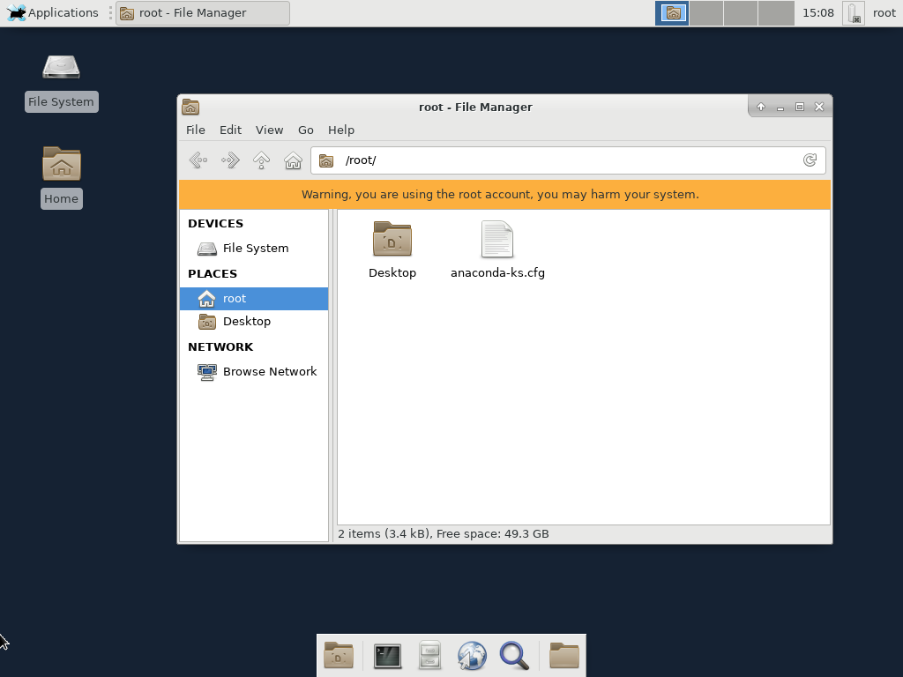

# centos-desktop

[](https://hub.docker.com/r/snowdreamtech/centos-desktop)

Docker Image packaging for centos-desktop.

(amd64, arm32v7, arm64v8, i386)

## Usage

```bash
docker run --name centos-desktop --rm -ti -d --privileged=true -p 5901:5901 -p 5902:5902  snowdreamtech/centos-desktop "/sbin/init"
```

Default Environment:

- DISPLAY=:1
- RESOLUTION=1920x1080x24
- VNC_PORT=5901
- VNC_PASSWORD=root

```bash
docker run --name centos-desktop --rm -d -p 5901:5901 -e VNC_PASSWORD=root snowdreamtech/centos-desktop
```

## Quick reference

- Where to file issues:

[https://github.com/snowdreamtech/centos-desktop/issues](https://github.com/snowdreamtech/centos-desktop/issues)

- Maintained by:

snowdream <sn0wdr1am@icloud.com>

- Supported architectures: ([more info](https://github.com/docker-library/official-images#architectures-other-than-amd64))

centos-desktop:

[amd64](https://cloud.docker.com/u/snowdreamtechamd64/repository/docker/snowdreamtechamd64/centos-desktop), [arm32v7](https://cloud.docker.com/u/snowdreamtecharm32v7/repository/docker/snowdreamtecharm32v7/centos-desktop), [arm64v8](https://cloud.docker.com/u/snowdreamtecharm64v8/repository/docker/snowdreamtecharm64v8/centos-desktop), [i386](https://cloud.docker.com/u/snowdreamtechi386/repository/docker/snowdreamtechi386/centos-desktop)

- Supported Tags:
  [centos-desktop](https://cloud.docker.com/u/snowdreamtech/repository/docker/snowdreamtech/centos-desktop/tags)

## Preview



## License

Apache 2.0
